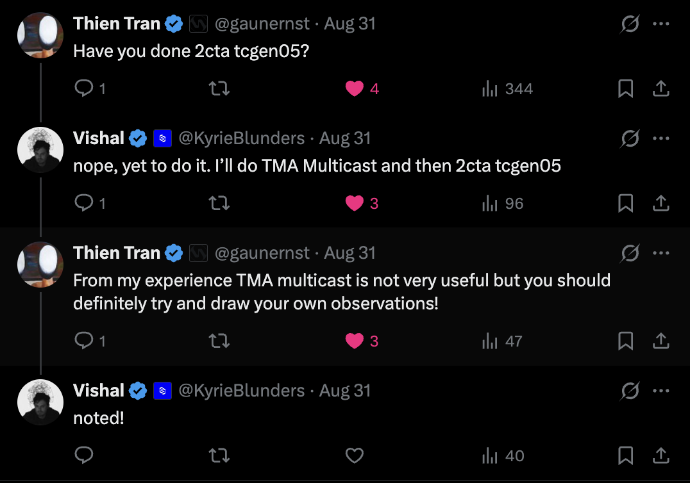
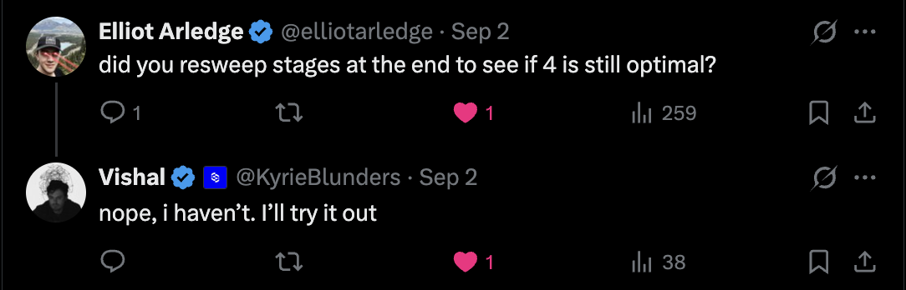

# Hand-writing a Blackwell GEMM: 164 to 1292 TFLOP/s

This is a log of taking a hand-written fp16 GEMM on a B200 from 11% of cuBLAS to 89%, one change at a time.

The rules I set myself: write it in CUTLASS's Python DSL (CuTeDSL), use the raw primitives (`tcgen05`, TMA, mbarriers, TMEM) and **not** the CUTLASS repo's helper abstractions, because the point was to learn what those helpers are hiding. Everything runs on Modal, on a single B200. Correctness is checked against torch on every single run.

One constraint shaped the whole project: **`ncu` does not work on Modal's B200**, so there is no profiler data anywhere in this post. Every conclusion below comes from wall-clock ablation, which means deleting part of the kernel and measuring what changes. That turned out to be a feature rather than a limitation, and the most valuable findings came out of it.

## The result

```
TFLOP/s at 4096^3                      (1 block = 30 TFLOP/s)

1. k-loop, 1 stage      164  |█████
2. 4-stage pipeline     304  |██████████                                   1.86x
3. warp specialized     304  |██████████                                   1.00x  null
4. 128B swizzle        1257  |██████████████████████████████████████████   4.13x
5. pipelined epilogue  1252  |██████████████████████████████████████████   1.00x  null
6. TMA multicast       1263  |██████████████████████████████████████████   1.00x  null
7. 2-CTA tcgen05       1292  |███████████████████████████████████████████  1.02x
   --------------------------|
   cuBLAS              1456  |█████████████████████████████████████████████████
```

7.9x from baseline to the end, and effectively all of it is **one** change.

Three of the six steps after the baseline measured **no improvement at all**. I kept them, reported them, and labelled them, because they turned out to be the more informative half of the project. The null at step 3 is what forced the ablations that found the change worth 4x.

Each step is a separate PR, so the diff for any single change is readable on its own:

| # | Change | Kernel | PR | Result at 4096³ |
|---|--------|--------|----|-----------------|
| 0 | starting point: multi-CTA, tensormap TMA | `gemm_02_multi_cta.py` | [#3](https://github.com/Vishal-Padia/blackwellize/pull/3) | K pinned to 16 |
| 1 | K-loop, 1 stage (baseline) | `gemm_03_k_loop.py` | [#4](https://github.com/Vishal-Padia/blackwellize/pull/4) | 0.11x |
| 2 | 4-stage pipeline | `gemm_04_pipelined.py` | [#5](https://github.com/Vishal-Padia/blackwellize/pull/5) | 0.21x |
| 3 | warp specialization | `gemm_05_warp_specialized.py` | [#7](https://github.com/Vishal-Padia/blackwellize/pull/7) | 0.21x (null) |
| 4 | 128B swizzle | `gemm_06_swizzling.py` | [#8](https://github.com/Vishal-Padia/blackwellize/pull/8) | **0.86x** |
| 5 | pipelined epilogue | `gemm_07_epilogue_pipelining.py` | [#9](https://github.com/Vishal-Padia/blackwellize/pull/9) | 0.86x (null) |
| 6 | TMA multicast | `gemm_08_tma_multicast.py` | [#10](https://github.com/Vishal-Padia/blackwellize/pull/10) | 0.86x (null) |
| 7 | 2-CTA tcgen05 | `gemm_09_2cta_tcgen05.py` | [#11](https://github.com/Vishal-Padia/blackwellize/pull/11) | **0.89x** |

## How performance was measured

Each kernel's `run()` uses CUDA events:

- record a start event
- run the kernel `iters` times (20 to 50)
- record a stop event, synchronize
- mean time per iteration is `start.elapsed_time(stop) / iters`

FLOPs use the standard GEMM count `2 * m * n * k`. `torch.matmul` runs on the same tensors, in the same process, on the same GPU, through the identical timing path. On fp16 CUDA tensors it dispatches to cuBLAS (cuBLASLt), not cuDNN.

**Noise floor.** Repeated runs of the same kernel spread by about 1.7 us, and the torch baseline by about 1.5 us. Anything under roughly **2% is not resolvable** here, which is why three steps below are reported as null rather than as small wins.

## The starting point

The kernel before the first step ([PR #3](https://github.com/Vishal-Padia/blackwellize/pull/3)) is deliberately minimal. Each CTA loads a single `128x256x16` MMA tile of A and B from global memory into shared memory via two `cute.copy()` calls behind an mbarrier, issues one UMMA through `cute.gemm()`, and writes the accumulator out.

K is pinned to exactly 16, which is one MMA instruction deep, so it is not yet a general GEMM. That is what the first step fixes.

Two mbarriers, each used exactly once, so both wait at phase 0 and there is no phase parity reasoning anywhere yet. The SMEM layout is plain and unswizzled (`SMEM_ATOM = (8, 8)`), and the epilogue is serial. Both of those come back to bite later.

# Optimization rungs

## 1. K-loop, 1 stage (baseline)

[PR #4](https://github.com/Vishal-Padia/blackwellize/pull/4) · `gemm_03_k_loop.py`

Each CTA previously performed exactly one MMA, which only works when K fits in a single `k=16` tile. This step splits K into chunks of 16, walks them one at a time, and accumulates into the same TMEM accumulator:

$$
C_{tile} = A_{0}B_{0}^{T} + A_{1}B_{1}^{T} + ... + A_{k/16}B_{k/16}^{T}
$$

Almost nothing about the partitioning changes, because the tensormap TMA from PR #3 already produced a k-tile mode. The loop is largely indexing a dimension that already existed. What it does introduce is three pieces of *semantics*:

- **Phase parity comes back.** Both mbarriers are now reused once per iteration, so each wait alternates phase 0 and 1 (`phase ^= 1`). Get this wrong and it hangs on iteration 1.
- **The `ACCUMULATE` field.** The first MMA overwrites TMEM, every later one adds. `cute.gemm` does not toggle this for you.
- **Single-stage serialization becomes visible.** With one buffer the loop is strictly load, wait, MMA, wait.

This is not an optimization and it is not fast. It is the first version that computes a general GEMM, and at 0.11x of cuBLAS it is the floor everything else is measured against. Per K-iteration it costs about 950 ns to move 12 KiB and issue one MMA, which is essentially one un-overlapped HBM round trip.

| Kernel  | Time     | TFLOP/s | Ratio |
|---------|----------|---------|-------|
| gemm_03 | 837.7 us | 164.1   | 0.11x |
| torch   | 93.5 us  | 1470.4  |       |

## 2. 4-stage pipeline

[PR #5](https://github.com/Vishal-Padia/blackwellize/pull/5) · `gemm_04_pipelined.py`

**`num_stages` is the number of SMEM buffers, not a split of K.** The two are independent, and confusing them is the single most common misreading of this step:

```
k = 4096, tile_k = 16   ->  256 K-tiles      (iterations of the loop)
num_stages = 4          ->    4 SMEM buffers (rotated through)
```

The loop still runs 256 times. What changes is that four buffers exist, so four loads can be in flight while an MMA runs:

```
step 1, one buffer:
  load t0 ─▶ MMA t0 ─▶ load t1 ─▶ MMA t1 ─▶ load t2 ─▶ ...
  nothing overlaps                                    ~950 ns / K-tile

step 2, four buffers:
  load t0 t1 t2 t3 ────────────────────────────▶
                MMA t0 ─▶ MMA t1 ─▶ MMA t2 ─▶ MMA t3 ─▶ ...
                        load t4 ─▶ load t5 ─▶ load t6 ─▶ ...
  load latency hidden behind compute                  ~500 ns / K-tile
```

A prologue fills all four buffers with tiles 0 to 3. Then iteration `k` waits on `ab_full_mbar + stage`, issues the MMA, and refills that same slot with tile `k + 4`. Because the refill targets the slot just consumed, and the MMA-done wait sits above it, no separate "empty" barrier is needed yet. One warp doing everything in program order is its own flow control.

Phase parity changes shape too. Each barrier is now reused once per *lap* around the ring rather than once per iteration, so `full_phase` flips when `stage` wraps to 0, while `done_phase` still flips every iteration.

Worth being precise about one thing: the MMAs do **not** run concurrently. They all accumulate into the same TMEM accumulator, so they are necessarily serial. Only the loads overlap.

| Kernel  | Time     | TFLOP/s | Ratio |
|---------|----------|---------|-------|
| gemm_04 | 451.7 us | 304.3   | 0.21x |
| torch   | 95.0 us  | 1447.1  |       |

**1.86x.** The largest win before the swizzle, and the only step whose mechanism is straightforwardly "hide memory latency behind compute".

## 3. Warp specialization

[PR #7](https://github.com/Vishal-Padia/blackwellize/pull/7) · `gemm_05_warp_specialized.py`

Previously one warp did both jobs in sequence, and warps 1 to 3 idled until the epilogue. This step splits the roles:

```
warp 0 (producer):  wait empty[s] ─▶ issue TMA into slot s ─▶ repeat
warp 1 (consumer):  wait full[s]  ─▶ MMA on slot s ─▶ commit empty[s] ─▶ repeat
warps 2-3:          idle until the epilogue
```

`empty[s]` is signalled by `tcgen05.commit` after the MMA, and it is how the producer learns a slot is reusable. The barriers are pre-armed at init so the producer's first lap does not block, which removes the prologue entirely. The loop becomes its own prologue.

**Measured: no change.** 451.4 us against step 2's 451.7.

The reason is worth stating, because it is what unlocked step 4. Warp specialization removes *issue serialization*, meaning one warp being unable to issue loads because it is blocked in the MMA path. But the single warp in step 2 was never blocked there: `cute.copy`, `cute.gemm` and `tcgen05.commit` are all asynchronous and return immediately. It was blocked at `wait full[stage]`, waiting for **data**. Splitting into two warps just gives you two warps waiting for the same data.

That null is what provoked the ablations in the Experiments section, which showed the load path was 92% of the runtime and did not respond to buffer depth, copy granularity, warp structure or occupancy. That is what finally pointed at the SMEM layout.

Kept anyway, because the per-stage `full`/`empty` barrier pair is a prerequisite for step 7, where a separate warp genuinely cannot learn about MMA completion any other way.

| Kernel  | Time     | TFLOP/s | Ratio |
|---------|----------|---------|-------|
| gemm_05 | 451.4 us | 304.4   | 0.21x |
| torch   | 94.4 us  | 1456.4  |       |

## 4. 128B swizzle

[PR #8](https://github.com/Vishal-Padia/blackwellize/pull/8) · `gemm_06_swizzling.py`

This is the step that matters: **4.13x**, and effectively the entire improvement over the baseline.

Shared memory is 32 banks of 4 bytes, wrapping every 128 bytes. With `tile_k = 64`, one row of A is 64 fp16, which is exactly 128 bytes, and the row stride is also 128 bytes. So **every row starts at bank 0**. TMA writes many rows concurrently and they all pile onto the same banks in the same order.

The fix chops each 128-byte row into eight 16-byte chunks and XORs the chunk index with the row index (`cute.make_swizzle(3, 4, 3)`, which is 8 rows by 8 chunks by 16 B):

```
         col:   0    1    2    3    4    5    6    7
row 0:        [ 0 ][ 1 ][ 2 ][ 3 ][ 4 ][ 5 ][ 6 ][ 7 ]
row 1:        [ 1 ][ 0 ][ 3 ][ 2 ][ 5 ][ 4 ][ 7 ][ 6 ]
row 2:        [ 2 ][ 3 ][ 0 ][ 1 ][ 6 ][ 7 ][ 4 ][ 5 ]
row 3:        [ 3 ][ 2 ][ 1 ][ 0 ][ 7 ][ 6 ][ 5 ][ 4 ]
row 4:        [ 4 ][ 5 ][ 6 ][ 7 ][ 0 ][ 1 ][ 2 ][ 3 ]
row 5:        [ 5 ][ 4 ][ 7 ][ 6 ][ 1 ][ 0 ][ 3 ][ 2 ]
row 6:        [ 6 ][ 7 ][ 4 ][ 5 ][ 2 ][ 3 ][ 0 ][ 1 ]
row 7:        [ 7 ][ 6 ][ 5 ][ 4 ][ 3 ][ 2 ][ 1 ][ 0 ]
                ^
                read down column 0: physical chunks 0..7,
                eight different bank groups. Conflict gone.
```

Bracketed numbers are *physical* chunk positions. Nothing moves between rows; it is a permutation within each row, and the address arithmetic is one XOR, so it costs nothing at runtime.

**The conflict is on TMA writes, not on MMA reads.** An ablation running the MMA chain alone with the unswizzled layout hit 1426 TFLOP/s, matching cuBLAS, which proves UMMA's SMEM reads were never the problem. Isolated on the load path, the swizzle is worth 4.8x (3.85 to 18.50 TB/s) on identical bytes.

Two mechanics worth writing down, because both cost me time:

- **A 128B swizzle requires `tile_k >= 64`**, because it needs 64 contiguous fp16. At `tile_k = 16` the atom does not fit the tile and the layout is rejected outright. And `tile_k = 64` on its own was measured and did nothing (448.5 us). Only the pair works, which is exactly why this took four steps to find: each half tested alone looks like a dead end.
- **The swizzle rides on the pointer, not the layout.** `make_fragment_A` rejects a composed layout, so `.inner` (the swizzle) goes to `recast_ptr` and `.outer` (the affine part) carries the appended stage mode. The base pointer needs 1024-byte alignment, since the pattern spans 8 by 128 B.

`tile_k = 64` also means four MMA instructions per loaded tile (`num_k_blocks = 64 / 16`), walked in an explicit loop with `ACCUMULATE` set to `True` after the first. `cute.gemm` does not toggle it across the MMA_K mode.

| Problem size     | Kernel  | Time (us) | TFLOP/s | Ratio |
|------------------|---------|-----------|---------|-------|
| 4096³, 50 iters  | gemm_06 | 109.3     | 1256.9  | 0.86x |
|                  | torch   | 93.8      | 1465.5  |       |
| 8192³, 20 iters  | gemm_06 | 862.9     | 1274.2  | 0.83x |
|                  | torch   | 719.4     | 1528.4  |       |

## 5. Pipelined epilogue

[PR #9](https://github.com/Vishal-Padia/blackwellize/pull/9) · `gemm_07_epilogue_pipelining.py`

The epilogue moves the accumulator out in four chunks, each going TMEM to RMEM to convert to GMEM. Steps 1 to 4 reuse a single `acc_frag`/`out_frag` pair for all four, which looks like a write-after-read hazard: chunk `i+1`'s TMEM read wants the registers chunk `i`'s conversion is still using. This step double-buffers them and issues chunk `i+1`'s read before converting chunk `i`.

**Measured: no change.** Three runs gave 108.8, 110.4 and 110.5 us against step 4's 109.3, all inside the noise floor.

The hazard does not exist. The DSL lowers to SSA, so each `cute.copy` produces a fresh value rather than writing a reserved register, and `range_constexpr` fully unrolls the loop. ptxas already saw four independent load/convert/store chains and pipelined them. I hand-wrote an optimization the compiler had already done.

For scale: the whole epilogue is at most about 13 us of the 109, so even a perfect version could not have been worth more than 12%.

| Kernel  | Time     | TFLOP/s | Ratio |
|---------|----------|---------|-------|
| gemm_07 | 109.8 us | 1251.6  | 0.86x |
| torch   | 94.6 us  | 1452.5  |       |

## 6. TMA multicast

[PR #10](https://github.com/Vishal-Padia/blackwellize/pull/10) · `gemm_08_tma_multicast.py`

At 4096³ the grid is 32 by 16, which is 512 CTAs. CTA `(bidx, bidy)` loads the A tile selected by `bidx` and the B tile selected by `bidy`, so the **16 CTAs sharing a `bidx` each independently request the same A tile**. Sixteen requests, identical bytes.

```
        bidy=0   bidy=1   bidy=2  ...
bidx=0   A0,B0    A0,B1    A0,B2      <- A0 fetched 16 times
bidx=1   A1,B0    A1,B1    A1,B2      <- A1 fetched 16 times
          ^^^^^ B0 fetched 32 times
```

Multicast makes one TMA request deliver into several CTAs' SMEM at once, which requires them to be in a cluster. With `cluster = (2, 2)`, `tma_partition` splits each tile across the multicast group so every CTA *issues* half a tile and *receives* a whole one. Both A and B get 2x, halving the bytes requested from L2.

The `empty` barrier becomes cluster-wide: three CTAs write into each CTA's slots (itself, the N-peer for A, the M-peer for B), so it collects three arrivals (`num_empty_arrivals = 3`) and `tcgen05.commit` carries a mask naming all of them.

**Measured: no change.** 108.9 us against step 5's 109.8.

I had been warned, and the warning was exactly right:



Thien Tran ([@gaunernst](https://x.com/gaunernst)) called it before I built it, and "draw your own observations" is the right way to put it, because the ablation explains *why*. Running the same load benchmark with **every CTA loading the identical tile**, which collapses L2 read traffic to nothing, ran at the same speed as loading 512 different tiles (406.5 vs 403.8 us).

L2 read traffic is not the constraint. Per-CTA SMEM fill is. Multicast reduces the former and leaves the latter completely untouched, because each CTA still writes a whole tile into its own SMEM.

Kept anyway, and it earned its place indirectly: building it is how I found `create_tma_multicast_mask`, and that function turned out to be the mechanism for cross-CTA barrier signalling in step 7, where it is used with no multicast in the kernel at all.

| Kernel  | Time     | TFLOP/s | Ratio |
|---------|----------|---------|-------|
| gemm_08 | 108.9 us | 1262.5  | 0.86x |
| torch   | 93.5 us  | 1469.6  |       |

## 7. 2-CTA tcgen05

[PR #11](https://github.com/Vishal-Padia/blackwellize/pull/11) · `gemm_09_2cta_tcgen05.py`

With `CtaGroup.TWO`, a **pair** of CTAs issues one 256-wide MMA together. Each supplies half the operands from its own SMEM and holds half the accumulator in its own TMEM.

```
CtaGroup.ONE                    CtaGroup.TWO
┌──────────┐  ┌──────────┐      ┌──────────┬──────────┐
│ SM 0     │  │ SM 1     │      │ SM 0     │ SM 1     │
│ own MMA  │  │ own MMA  │      │ ←── one MMA, M=256 ─→│
│ 128x256  │  │ 128x256  │      │ 128 rows │ 128 rows │
└──────────┘  └──────────┘      └──────────┴──────────┘
                                  leader     follower
```

The cluster is `(2, 1)`, so just the pair, with no multicast. That configuration was suggested to me directly:


Simon V ([@Simon_Vt](https://x.com/Simon_Vt)) was right, and it is also the configuration that made the step debuggable: stripping multicast left exactly one new variable.

The two CTAs are **not** symmetric peers, and getting that wrong is what made this step hard:

|                                   | leader (`bidx % 2 == 0`) | follower            |
|-----------------------------------|--------------------------|---------------------|
| wait `empty`                      | yes                      | yes                 |
| `arrive_and_expect_tx` on `full`  | **yes**                  | no                  |
| issue TMA copies                  | yes                      | yes                 |
| wait `full`                       | yes                      | no                  |
| issue `cute.gemm`                 | **yes**                  | no                  |
| `commit` to `empty` (masked)      | **yes**                  | no                  |
| wait `mma_done`                   | yes                      | via cluster barrier |

There is **one `full` barrier per pair** (the leader's) armed for the whole pair's bytes (`tx_count = (A + B) x 2`), and both CTAs' copies land on it. Only the leader arms it and only the leader waits on it, because only the leader issues the MMA. Treating the pair as two CTAs with private half-sized pipelines was the mis-model underneath most of the debugging.

Three further things, each individually enough to break it:

- **The M coordinate is the pair index**, `bidx // 2`, not `bidx`. Two consecutive CTAs are two halves of the *same* 256-row tile. The grid still counts CTAs, so `grid.x = m / 128` while the tiler counts in 256s.
- **`tiled_mma.get_slice(cta_rank_m)`**, not `get_slice(0)`. The slice index is the CTA's position in the pair and it drives the A, B and C partitioning. Slice 0 for both makes them compute the same half and leave the other unwritten.
- **`tcgen05.commit` reaches only the CTAs named in its mask.** Since only the leader commits, `empty` *must* name the pair peer, or the follower is never released and the kernel deadlocks on lap 2. This mask is load-bearing, not a formality. `mma_done` passes no mask, which is exactly why the follower's epilogue is gated on a cluster barrier instead.

Nothing is merged between the CTAs. Each holds its own 128 rows of the accumulator and writes its own half of C. The cluster barrier exists so the follower does not read TMEM before the leader's MMAs retire.

The gain is smaller than the arithmetic predicted. Per-CTA arithmetic intensity rises from `128*256/(128+256)` = 85 to `256*256/512` = 128 FLOP/byte, so 1.5x fewer bytes per FLOP, but the measured gain is 1.02x. The ceiling did move (1292 is above the 1257 that `CtaGroup.ONE` was topping out at) just not by the available margin, which means something else became binding at step 4 and is still there.

| Kernel  | Time     | TFLOP/s | Ratio |
|---------|----------|---------|-------|
| gemm_09 | 106.4 us | 1291.6  | 0.89x |
| torch   | 94.4 us  | 1455.7  |       |

# Experiments

**A note on authorship: the experiments in this section were done entirely by Claude, not by me.** I wrote the kernels; the ablations, the bisects and the sweeps below were designed and run by it. I am flagging that because the ablations are where most of the actual findings came from, and it would be misleading to present them as mine.

Not every idea landed, and the ones that failed did more to locate the bottleneck than the ones that worked. The sweeps have runnable versions in `experiments/`; the one-off ablations were throwaway variants of whichever kernel was current at the time. All numbers are B200, fp16, correctness checked against torch.

## Locating the bottleneck (after step 3)

Steps 2 and 3 sat at about 451 us and would not move. Four ablations at 4096³:

| variant | time | conclusion |
|---|---|---|
| MMA chain only, no loads | **96.4 us** (1426 TFLOP/s) | compute already at 1.00x cuBLAS |
| loads only, no MMA | **417.3 us** | loads are 92% of the runtime |
| 8 stages instead of 4 | 454.6 us | not latency-bound |
| `tile_k` 64 instead of 16 (4x fewer copies) | 448.5 us | not copy-issue-bound |
| 2 CTAs/SM (`tmem_cols=256`) | 555.0 us | *worse*, more concurrency hurt |

The MMA chain alone matching cuBLAS was the key result: 100% of the gap was the load path, and it responded to nothing I did to the pipeline. The stage count gets re-swept at the end of this section, once the bottleneck has moved, and the answer changes.

That last row is worth a note of its own. `tmem_cols = 512` over-allocates the 128x256 accumulator, which needs 256, and that over-allocation pins the kernel to one CTA per SM. Halving it to allow two CTAs per SM made the kernel 23% *slower*. The over-allocation is load-bearing and is deliberately left in place.

## Raw TMA throughput: what found the swizzle

A kernel with no MMA, no consumer and no empty barriers: fire a batch of TMA copies, wait for the batch, repeat. It measures only how fast an SM can pull these tiles into SMEM. Identical bytes, identical copies, only the SMEM layout differs:

| SMEM layout | time | achieved |
|---|---|---|
| `tile_k=64`, no swizzle | 418.2 us | 3.85 TB/s |
| `tile_k=64`, 128B swizzle | **87.1 us** | **18.50 TB/s** |

4.8x on the load path from a layout change that moves no extra bytes. A 4-way bank conflict predicts about 4x, so mechanism and magnitude agree.

## Is it L2 or SMEM fill?

Before building multicast, the same benchmark with **every CTA loading the identical tile**, which collapses L2 read traffic to nothing:

| | time | achieved |
|---|---|---|
| 512 CTAs, different tiles | 403.8 us | 3.99 TB/s |
| 512 CTAs, identical tile | 406.5 us | 3.96 TB/s |

No change. L2 read traffic is not the constraint, per-CTA SMEM fill is. This predicted the step 6 null result before it was built.

## Bisecting the 2-CTA deadlock

Step 7 hung, and ten attempts at reading the protocol out of API signatures did not fix it. What worked was shrinking the problem until it terminated. `m=n=256, k=192` gives 3 K-tiles against `num_stages=3`, so the pipeline never has to recycle a stage:

| variant | k | result |
|---|---|---|
| producer only | 192 | completes |
| + leader waits `full` | 192 | completes, so transaction accounting is correct |
| full kernel | 192 | completes, so MMA and drain are fine |
| full kernel | 1024 | **hangs**, so it is isolated to `empty` recycling |
| + peer named in the commit mask | 1024 | completes |

A `tcgen05.commit` reaches only the CTAs named in its mask. With the leader as sole committer, the follower's `empty` barrier received nothing on lap 2. The peer masks in `cutlass/pipeline/sm100.py` exist for exactly this. They are the pair-peer signalling mechanism, not a multicast detail.

The lesson I want to keep: when a hang survives more than two fixes, stop reasoning and shrink it until it terminates. Two short runs did what ten guesses could not.

## Re-sweeping the stage count

`modal run experiments/stage_sweep.py`

Asked at the end, and worth asking:



Elliot Arledge ([@elliotarledge](https://x.com/elliotarledge)) was pointing at something real. The stage sweep in the table above ran at step 3, when `tile_k` was 16, the layout was unswizzled, and every stage count measured identically because the load path was bank-conflict bound. Three things changed after that: `tile_k` became 64, the swizzle landed, and 2-CTA halved the per-CTA operand size. SMEM per stage went from 12 KiB to 32 KiB, so the whole trade-off moved.

| stages | SMEM | 4096³ | ratio | 8192³ | ratio |
|---|---|---|---|---|---|
| 2 | 64 KiB | 166.9 us | 0.57x | 1210.5 us | 0.62x |
| 3 | 96 KiB | 124.3 us | 0.77x | 958.8 us | 0.78x |
| 4 | 128 KiB | 110.5 us | 0.86x | 848.5 us | 0.88x |
| 5 | 160 KiB | **105.9 us** | **0.90x** | 858.9 us | 0.87x |
| 6 | 192 KiB | 106.2 us | 0.90x | **843.5 us** | **0.89x** |
| 7 | 224 KiB | 106.8 us | 0.89x | 858.7 us | 0.87x |

**4 is not optimal any more.** It saturates at 5, and 4 stages leaves about 4% on the table (0.86x versus 0.90x at 4096³). The shipped kernel runs 6, which is within noise of the best at both sizes, so nothing needed changing, but that was luck rather than measurement.

The more interesting half is the shape of the curve. At step 3, going from 4 stages to 8 to 12 was completely flat (454.6 and 454.1 us against 451.7), which is what told me the kernel was not latency-bound. Now 2 stages costs 43% and depth clearly matters up to 5. Same knob, same kernel lineage, opposite conclusion, purely because the bottleneck moved. A sweep is only valid in the regime it was run in.

## Shape sweep

`modal run experiments/shape_sweep.py`

```
                 shape       ours  TFLOP/s      torch  TFLOP/s  ratio
  4096x4096x4096        107.7   1275.6       94.4   1456.1   0.88x
  8192x8192x8192        846.1   1299.5      779.9   1409.8   0.92x
  2048x2048x2048         18.8    912.5       14.4   1189.9   0.77x
  4096x4096x512          33.2    517.4       14.5   1184.3   0.44x   <-- worst
  8192x1024x4096         57.2   1201.2       48.3   1422.8   0.84x
  1024x8192x4096         57.3   1199.2       48.5   1418.3   0.85x
  4096x4096x16384       402.2   1366.7      369.8   1486.7   0.92x   <-- best
```

Deep K is where the kernel is strong, short kernels are where it loses. At `k=512` there are only 8 K-tiles against 6 pipeline stages, so the pipeline never reaches steady state and prologue plus drain plus epilogue are most of the runtime. That is a fixed-cost problem, which is what a persistent kernel would address.

## Threadblock swizzle

`modal run experiments/swizzle_sweep.py`

This one also came from a suggestion:


subho ghosh ([@SubhoGhosh02](https://x.com/SubhoGhosh02)) named both remaining levers. I built the first one.

Instead of CTA `(bidx, bidy)` taking output tile `(bidx, bidy)`, walk `swizzle_m` pair-tiles down M before stepping along N, so neighbouring CTAs share B tiles in L2. The CTA pair must stay intact, so only the `(pair_m, n)` grid is permuted.

```
  8192x8192x8192   torch  739.6 us  1486.6 TFLOP/s
     swizzle_m=1      848.2 us  1296.2   0.87x
     swizzle_m=4      803.0 us  1369.3   0.92x
     swizzle_m=8      785.6 us  1399.5   0.94x   <-- optimum
     swizzle_m=16     802.8 us  1369.7   0.92x
     swizzle_m=32     846.6 us  1298.7   0.87x

  4096x4096x16384  torch  402.5 us  1365.8 TFLOP/s
     swizzle_m=8      401.4 us  1369.6   1.00x   <-- parity with cuBLAS
```

**0.94x at 8192³, and 1.00x at 4096x4096x16384.** That is the first time anything here matched cuBLAS.

Group size 8 is a real optimum: 16 and 32 both regress, because a too-tall group stops sharing B tiles. It does nothing at 4096³ (107.4, 107.8, 108.5 us for g1, g4, g8), because there are only 256 pair-tiles over 148 SMs, so there are not enough waves for ordering to matter.

One caveat, and it is mine: the mapping assumes `pairs_m % swizzle_m == 0` where `pairs_m = m / 256`. Violate it and CTAs walk off the end of M. `swizzle_m=32` at `m=4096` reports a spurious 1.13x with `max |c - ref| = 772`. The runner flags the non-divisible combinations so that fake win cannot be mistaken for a real one.

# What is left

Two things, and the second is the more interesting one.

**CLC, or a persistent kernel.** Blackwell's Cluster Launch Control lets CTAs pull tiles from a hardware work queue instead of a fixed grid. That is aimed squarely at the `k=512` case sitting at 0.44x, because it amortises the per-tile fixed cost that threadblock swizzle cannot touch. `cutlass/utils/dynamic_persistent_tile_scheduler.py` and the `ClcLoad` pipeline op are the entry points.

**Multicast on top of 2-CTA.** While failing to run `ncu`, I did get to see the name of the cuBLAS kernel I had been racing all along:

```
nvjet_sm100_hsh_128x256_64x6_2x2_2cta_h_bz_TNT
```

Decoded: a 128x256 tile, 64-deep K, 6 stages, a **2x2 cluster**, and **2-CTA** MMA. Which is to say cuBLAS is not doing anything exotic. It is almost exactly the configuration I converged on, tuned properly, and the one remaining difference is that cuBLAS runs a 2x2 cluster where my step 7 runs `(2, 1)`.

So the last gap is a configuration difference I already know how to close, on a kernel that already works. Which is a much better place to end than where this started.

*Code, per-step PRs and the experiment runners are at [github.com/Vishal-Padia/blackwellize](https://github.com/Vishal-Padia/blackwellize).*
